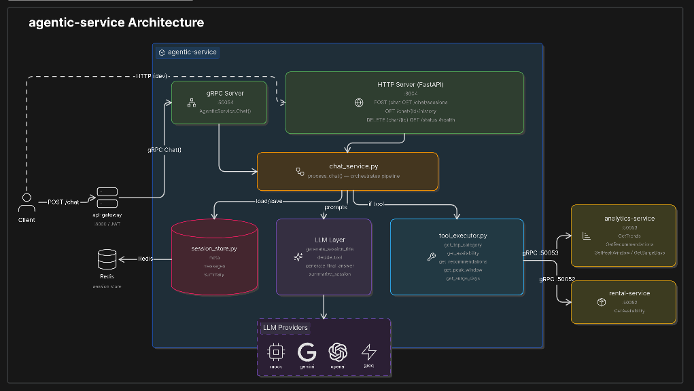

# RentPi — HACKSPARK

> **Technocracy Lite · 10 Hours · Onsite · Team of 3**  
> A fully gRPC-backed microservices platform for a real-world rental marketplace.

---

## Architecture


```
Client (Browser)
  │
  ├─── Next.js Frontend :3000  (SSR proxy → api-gateway)
  │
  └─── API Gateway :8000  (JWT validation · HTTP → gRPC)
         │
         ├── gRPC → user-service      :50051  → PostgreSQL
         ├── gRPC → rental-service    :50052  → Central API
         ├── gRPC → analytics-service :50053  → Central API
         └── gRPC → agentic-service   :50054  → Redis
                                               → rental-service (tool calls)
                                               → analytics-service (tool calls)
```

| Service | HTTP Port | gRPC Port | Responsibility |
|---------|-----------|-----------|----------------|
| `api-gateway` | 8000 | — | JWT auth, HTTP→gRPC routing, `/status` aggregation |
| `user-service` | 8001 | 50051 | Register / login / me / discount — PostgreSQL + Alembic |
| `rental-service` | 8002 | 50052 | Products, availability, interval algorithms — Central API proxy |
| `analytics-service` | 8003 | 50053 | Trends, surge, recommendations, peak window — Central API proxy |
| `agentic-service` | 8004 | 50054 | AI chatbot with Redis-backed session history |
| `frontend` | 3000 | — | Next.js 16 / React 19 / Tailwind CSS 4 |

Infrastructure: **PostgreSQL 16**, **Redis 7** (session store + Central API rate limiter).

---

## Quick Start

### Prerequisites

- Docker Desktop v24+ (set RAM ≥ 6 GB on Windows)
- Git

### Run

```bash
git clone https://github.com/Galib-23/hackspark-starter
cd hackspark-starter

cp .env.example .env
# Set CENTRAL_API_TOKEN and JWT_SECRET in .env

docker compose up --build
```

| Service | URL |
|---------|-----|
| API Gateway (Swagger) | http://localhost:8000/docs |
| Frontend | http://localhost:3000 |
| Aggregated status | http://localhost:8000/status |

> First build takes 3–5 minutes. Subsequent builds use layer cache.

### With monitoring (Prometheus + Grafana)

```bash
docker compose -f docker-compose.prod.yml up --build
```

| Tool | URL |
|------|-----|
| Prometheus | http://localhost:9090 |
| Grafana (`Hackspark Overview` dashboard) | http://localhost:9091 |

Default Grafana credentials: `admin` / `admin`.

---

## Development

```bash
cp .env.example .env      # fill in CENTRAL_API_TOKEN and JWT_SECRET
uv sync                   # install Python deps
make up-build             # start stack
```

| Command | Description |
|---------|-------------|
| `make up` / `make down` | Start / stop stack |
| `make down-v` | Stop and wipe volumes |
| `make proto` | Regenerate gRPC stubs from `proto/*.proto` |
| `make migrate-user` | Apply user-service Alembic migrations |
| `make format` | Run ruff formatter |
| `make lint` | Run ruff linter |
| `make typecheck` | Run ty on all packages |
| `make test` | Run pytest |
| `make check` | format + lint + typecheck + test |

Set `LLM_PROVIDER` in `.env` to use the AI chat endpoint:
- `mock` — no API key, deterministic responses (default)
- `gemini` — requires `GEMINI_API_KEY` (free tier, recommended)
- `openai` — requires `OPENAI_API_KEY`
- `groq` — requires `GROQ_API_KEY`

---

## Smoke Test

```bash
export API="http://localhost:8000"

# Register and login
curl -X POST $API/users/register -H "Content-Type: application/json" \
  -d '{"email":"test@example.com","password":"password123","name":"Test User"}'

TOKEN=$(curl -s -X POST $API/users/login -H "Content-Type: application/json" \
  -d '{"email":"test@example.com","password":"password123"}' \
  | python3 -c "import sys,json; print(json.load(sys.stdin)['access_token'])")

# Protected endpoints
curl -H "Authorization: Bearer $TOKEN" $API/users/me
curl -H "Authorization: Bearer $TOKEN" $API/rentals/products
curl -H "Authorization: Bearer $TOKEN" $API/analytics/trends

# Chat
curl -X POST $API/chat -H "Authorization: Bearer $TOKEN" \
  -H "Content-Type: application/json" \
  -d '{"query":"Which category is trending?","top_k":3}'
```

See [`docs/chat-curl-examples.md`](./docs/chat-curl-examples.md) for the full chat session flow.

---

## Agentic Chat Service



The agentic-service (`agentic-service/ai_agent_service/`) is the AI layer of the platform. It receives natural-language queries through the API gateway via gRPC and returns grounded answers backed by live rental and analytics data.

### Architecture overview

```
Client
  └── POST /chat (HTTP, JWT required)
        └── api-gateway :8000
              └── gRPC → agentic-service :50054
                    ├── Redis (session memory)
                    ├── gRPC → analytics-service :50053  (trends, surge, peak window, recommendations)
                    └── gRPC → rental-service :50052     (product availability)
```

The gateway translates the HTTP `/chat` request into a `AgenticService.Chat` gRPC call. The service processes the query, makes tool calls if needed, and returns a grounded answer.

### Request lifecycle

Each chat turn goes through four stages:

1. **Session load** — The service loads the rolling summary and the last N messages (`chat_recent_messages_limit`, default 5) from Redis. If this is a new session the LLM generates a short title.

2. **Tool decision** — The LLM receives the session context and the current query and decides which tool (if any) to call. If a tool is needed but required arguments are missing, the LLM responds conversationally asking for only the missing information instead of guessing.

3. **Tool execution** — If a tool was selected, its handler makes a gRPC call to the appropriate downstream service and returns structured data. On failure the tool result is marked `status: failed` so the LLM can acknowledge unavailability instead of fabricating numbers.

4. **Answer generation** — The LLM synthesises the session context, the current query, and the tool result into a final human-readable answer. The system prompt forbids inventing numbers, dates, or statistics.

After each turn the full message pair (user + assistant) is appended to the Redis message list and the rolling summary is regenerated.

### Memory system

Session state is stored in three Redis keys per session:

| Key | Contents | Purpose |
|-----|----------|---------|
| `session:<id>:meta` | JSON — name, summary, lastMessageAt | Session index shown in the sidebar |
| `session:<id>:messages` | JSON list of `{role, content, ts}` entries | Full raw history, used for display |
| `session:<id>:summary` | Plain-text rolling summary | Injected into every LLM prompt to give long-term context without sending the entire message list |

**Rolling summary**: After every turn the LLM is asked to compress the message window (last `summary_message_window`, default 8 messages) into 4–6 lines, preserving user intent, categories, and key numbers. This summary replaces the previous one. The result is that the LLM always has context for the full conversation even when the raw message list is truncated.

**Short-term context**: In addition to the summary, the last 5 raw messages are passed verbatim to every LLM call so phrasing and exact values from the most recent exchanges are preserved without rephrasing artefacts.

**TTL**: When `REDIS_SESSION_TTL_SECONDS` is set (> 0) all three keys are refreshed to that TTL on every write. Set to `0` to keep sessions indefinitely.

### Query routing and tool use

The LLM classifies every incoming query into one of these outcomes:

| Query type | Tool called | gRPC target |
|------------|-------------|-------------|
| "Which category is trending?" / "What is most rented?" | `get_top_category` | `analytics-service → GetTrends` |
| "Is product 42 available from June 1 to June 7?" | `get_availability` | `rental-service → GetAvailability` |
| "What should I rent next?" / "Recommend something" | `get_recommendations` | `analytics-service → GetRecommendations` |
| "When is the peak rental window from Jan to Mar?" | `get_peak_window` | `analytics-service → GetPeakWindow` |
| "What were the surge days in April?" | `get_surge_days` | `analytics-service → GetSurgeDays` |
| General question about the platform / auth / policies | *(no tool)* | Session memory only |
| Off-topic question | *(no tool)* | Session memory + polite decline |

When required arguments are missing (e.g., product ID or date range for availability), the LLM issues a clarification request instead of calling the tool. The turn is recorded in history so the user can answer naturally in the next message and the context is preserved.

### LLM providers

Set `LLM_PROVIDER` in `.env`:

| Value | Model | Notes |
|-------|-------|-------|
| `mock` | Hard-coded responses | No API key, deterministic — good for tests |
| `gemini` | `gemini-2.5-flash` | `GEMINI_API_KEY` required (free tier) |
| `openai` | `gpt-4o-mini` | `OPENAI_API_KEY` required |
| `groq` | `llama-3.1-8b-instant` | `GROQ_API_KEY` required |

All providers share the same `PromptDrivenLLM` base which handles tool-decision parsing, answer generation, and session summarisation. Switching provider requires only changing `LLM_PROVIDER` — no code changes.

### Anti-hallucination guarantees

- The system prompt explicitly forbids inventing numbers, dates, product names, or statistics.
- If a tool call fails the payload contains `status: failed` — the LLM is instructed to apologise and report unavailability rather than produce a plausible-sounding answer.
- All numeric data originates from live gRPC calls to downstream services. The LLM never performs arithmetic or estimation on its own.

---

## What's Implemented

### Chapter 1 — Foundation

| # | Problem | Points |
|---|---------|--------|
| P1 | Health checks — per-service `/status` + parallel gateway aggregation | 20 |
| P2 | User auth — register / login / me, Argon2 hashing, JWT | 40 |
| P3 | Product proxy — transparent Central API proxy with token injection | 30 |
| P4 | Docker Compose + multistage builds, named volumes, health checks | 40 |

### Chapter 2 — Data Layer

| # | Problem | Points |
|---|---------|--------|
| P5 | Paginated product listing with cached category validation | 50 |
| P6 | Loyalty discount — security score tiers from Central API | 35 |
| P7 | Availability — merge overlapping intervals, free windows | 65 |
| P8 | K-th busiest date — bounded heap, O(n log k) | 70 + 15 |
| P9 | Top-k renter categories — batch product fetch, bounded heap | 60 + 10 |
| P10 | Longest free streak — clip + merge + gap scan | 65 |

### Chapter 3 — Intelligence Layer

| # | Problem | Points |
|---|---------|--------|
| P11 | 7-day peak window — sliding window, O(n) | 80 |
| P12 | Merged feed — K-way merge with tournament heap, O(n log K) | 80 |
| P13 | Surge days — monotonic stack next-greater, O(n) | 55 |
| P14 | Seasonal recommendations — 15-day rolling window, past 2 years | 60 + 10 |
| P15 | RentPi Assistant — grounded AI chat (no hallucination, topic guard) | 80 |
| P16 | Chat sessions — Redis-backed history, resumable multi-turn | 60 |

### Chapter 4 — Frontend

| # | Problem | Points |
|---|---------|--------|
| P17 | Full Next.js UI — login, products, availability, chat with session sidebar | 80 |
| P18 | Trending widget — live recommendations with skeleton loading states | 50 |
| P19 | Lean images — distroless frontend runner, alpine Python bases | 40 |

### Bonus

| # | Problem | Points |
|---|---------|--------|
| B1 | gRPC internal communication — all services use gRPC (not just agentic) | +50 |
| B2 | Graceful rate limiting — sliding window + exponential backoff + 503 after 3 retries | +40 |

**Total possible: 1,060 base + 125 bonus**

---

## Central API

**Base URL:** `https://technocracy.brittoo.xyz`  
**Rate limit:** 30 req/min per token · violation penalty: −20 pts each  
**Our enforced ceiling:** 20 req/min per service process (10 req/min safety buffer)

All Central API calls go through `shared/app_core/central_api.CentralAPIClient` — never raw `httpx`. The client enforces the sliding-window rate limit with backpressure and retries with exponential backoff + jitter.

---

## If We Had More Time (6:00 PM Push vs. 7:00 PM Deadline)

The hackathon deadline was 7 PM but we submitted at 6 PM under time pressure. Here's what the last hour would have gone toward:

**6:00 – 6:30 — Testing the Trending page**  
The `/app` Trending widget was implemented but never manually tested end-to-end in the browser. A 30-minute session would have caught rendering edge cases, skeleton loading states, and any disconnect between the analytics gRPC response shape and what the frontend expected.

**Better prompts for the chat service**  
The current system prompt is functional but conservative. With more time we would have iterated on the tool-decision prompt (fewer false negatives on ambiguous queries), the clarification phrasing (more conversational, less form-like), and the final-answer prompt (better formatting for list-style tool results like surge days and recommendations).

**P14 — Seasonal recommendations algorithm + chat grounding**  
P14 (15-day rolling window, past 2 years of data) was designed but not finished under the clock. Completing it would have meant: implementing the algorithm in `analytics-service`, wiring it into the `get_recommendations` tool in the agentic service, and surfacing it as a chat query type — e.g. "What tends to be popular around this time of year?"

---

## Tech Stack

**Backend:** Python 3.12 · FastAPI 0.116 · gRPC 1.68 · SQLAlchemy 2.0 · Pydantic 2.10 · Alembic  
**Storage:** PostgreSQL 16 · Redis 7  
**LLM:** Gemini 2.5 Flash / OpenAI gpt-4o-mini / Groq llama-3.1 / Mock  
**Frontend:** Next.js 16 · React 19 · TypeScript 5 · Tailwind CSS 4  
**Tooling:** uv · ruff · ty · pytest · Docker Compose  
**Observability:** structlog · Prometheus · Grafana · cAdvisor

---

## Documentation

| Doc | Contents |
|-----|----------|
| [`docs/architecture.md`](./docs/architecture.md) | Service map, gRPC contracts, request flow, data ownership |
| [`docs/api-documentation.md`](./docs/api-documentation.md) | All HTTP endpoints with request/response shapes |
| [`docs/development-guide.md`](./docs/development-guide.md) | Local setup, gRPC workflow, adding endpoints and services |
| [`docs/operations.md`](./docs/operations.md) | Docker runtime, env vars, migrations, troubleshooting |
| [`docs/observability.md`](./docs/observability.md) | Logging, Prometheus metrics, Grafana dashboard, demo workflow |
| [`docs/git-workflow.md`](./docs/git-workflow.md) | Branch strategy, commit guidelines, PR checklist |
| [`docs/chat-curl-examples.md`](./docs/chat-curl-examples.md) | End-to-end curl examples for the chat flow |
| [`docs/algorithms/`](./docs/algorithms/) | Algorithm write-ups for P7–P14 |

---

*TECHNOCRACY LITE Presents — HACKSPARK, organised by Dept. of ECE, RUET*
